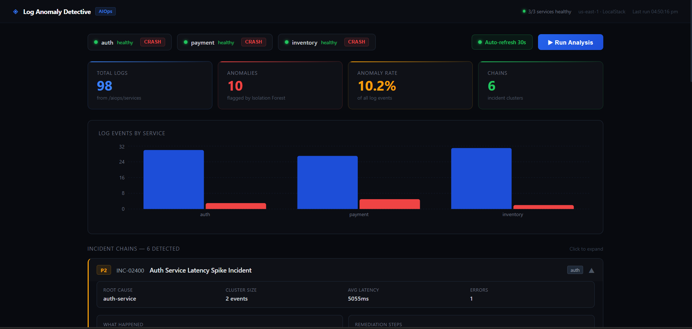
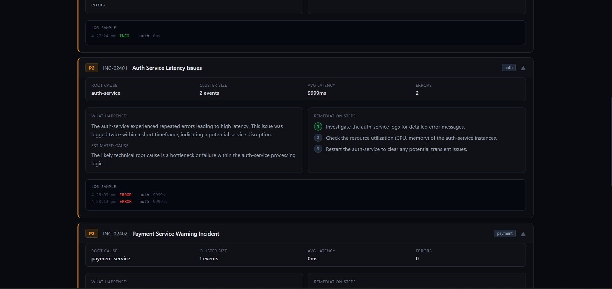
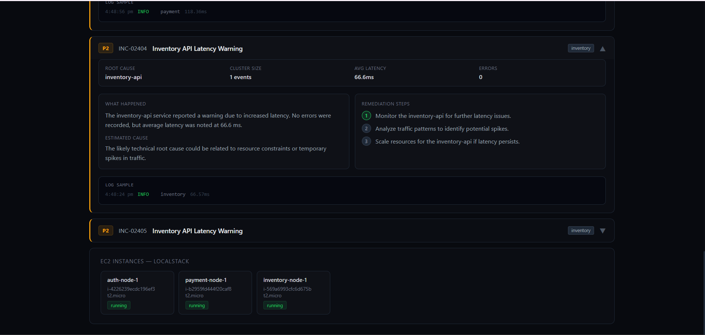
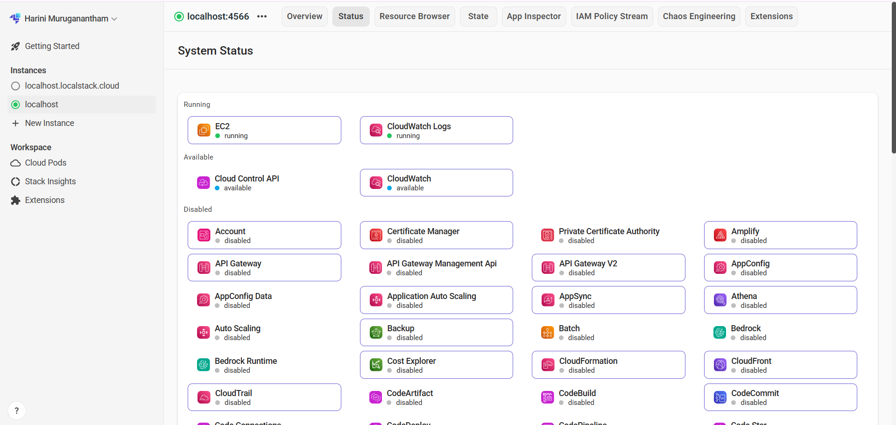
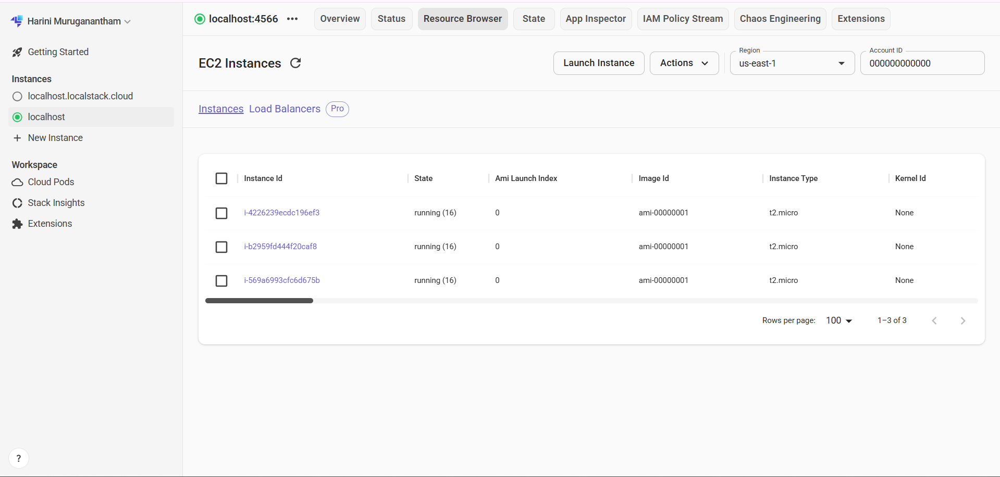
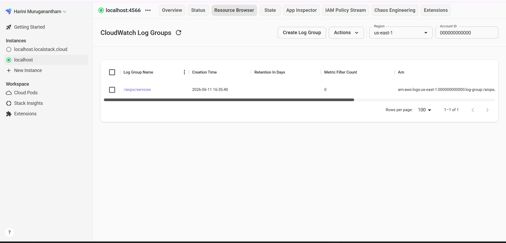
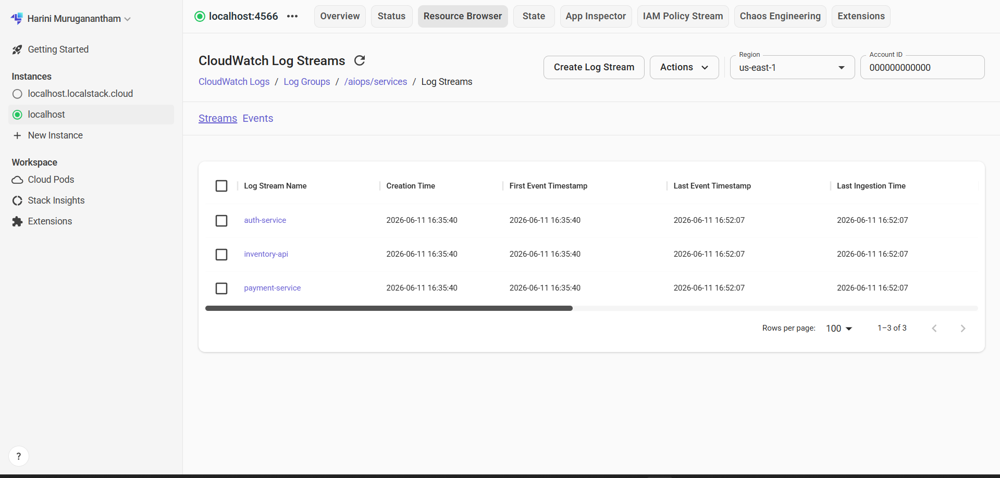
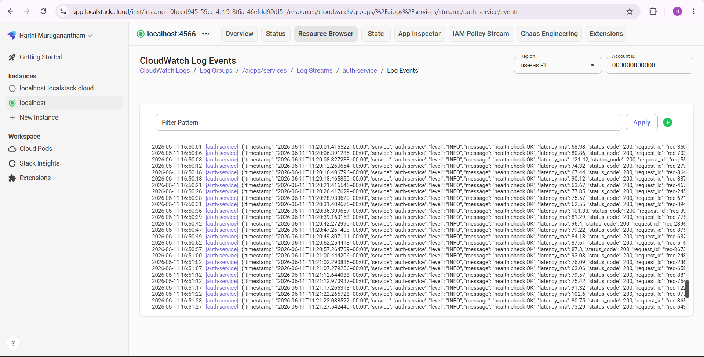

# LogSentinel

<div align="center">


**A production-grade AIOps portfolio project that detects anomalies in microservice logs using Isolation Forest + GPT-4o-mini, backed by LocalStack CloudWatch and a real-time React dashboard.**

[Portfolio](https://harini-devops-portfolio.vercel.app) · [Report Bug](https://github.com/HariniMuruganantham/LogSentinel/issues)

</div>

---

## 📋 Table of Contents

- [Overview](#-overview)
- [Architecture](#-architecture)
- [Tech Stack](#-tech-stack)
- [Features](#-features)
- [Dashboard Screenshots](#-dashboard-screenshots)
- [LocalStack Screenshots](#-localstack-screenshots)
- [Project Structure](#-project-structure)
- [Getting Started](#-getting-started)
- [Environment Variables](#-environment-variables)
- [API Reference](#-api-reference)
- [LocalStack Integration](#-localstack-integration)
- [Author](#-author)

---

## 🧠 Overview

**LogSentinel** is a full-stack AIOps project that simulates a microservice environment, ingests service logs into AWS CloudWatch (via LocalStack), detects anomalies using an Isolation Forest model, and generates human-readable incident reports using GPT-4o-mini.

Built as a portfolio project to demonstrate real-world DevOps and MLOps skills — containerisation, cloud-native observability, and AI-driven alerting — all running locally with production-grade tooling.

> **Why this project?** Most anomaly detection demos are Jupyter notebooks. LogSentinel ships with Docker Compose, LocalStack CloudWatch integration, EC2 instance seeding, and a live React dashboard — the way it would actually be built on the job.

---

## 🏗 Architecture


| Layer | Role |
|---|---|
| **Microservices** | 3 Flask services push structured JSON logs to LocalStack CloudWatch via `PutLogEvents` on every request |
| **LocalStack** | Emulates AWS CloudWatch Logs + EC2 locally — no real AWS account needed |
| **Backend** | FastAPI pulls logs via `GetLogEvents`, runs Isolation Forest, chains anomaly clusters, calls GPT-4o-mini |
| **Frontend** | React + Vite dashboard polls service health, displays incident cards, chart, and EC2 panel |

---

## 🛠 Tech Stack

| Layer | Technology |
|---|---|
| **Backend API** | FastAPI, Uvicorn, Python 3.12 |
| **Anomaly Detection** | Scikit-learn Isolation Forest |
| **AI Analysis** | OpenAI GPT-4o-mini |
| **Microservices** | Flask (auth, payment, inventory) |
| **Frontend** | React 18, Vite, Nginx Alpine |
| **Cloud Emulation** | LocalStack Pro (CloudWatch Logs, EC2) |
| **Containerisation** | Docker, Docker Compose |
| **CI/CD** | GitHub Actions |
| **Observability** | AWS CloudWatch Logs |

---

## ✨ Features

- **Real log ingestion** — 3 Flask microservices push structured JSON logs to LocalStack CloudWatch via `PutLogEvents` on every request
- **Anomaly detection** — Isolation Forest scores each log event across latency, error rate, and status codes; consecutive outliers are grouped into incident clusters
- **AI-powered incident reports** — GPT-4o-mini generates plain-English summaries with root cause, estimated cause, impact, and 3-step remediation per cluster
- **Failure propagation tracking** — RCA chaining traces how failures cascade across services and renders a visual propagation timeline
- **Service crash simulation** — hit CRASH on any service from the dashboard; it actually degrades — latency spikes to 3–8s, error rate hits 90%, health checks fail
- **Auto-refresh** — toggle 30-second automatic analysis polling directly from the nav bar
- **EC2 topology panel** — mock EC2 instances seeded with `Project=logsentinel` tag, shown in a live infrastructure panel at the bottom of the dashboard
- **LocalStack CloudWatch** — full AWS CloudWatch Logs + EC2 API emulation, inspectable in the LocalStack web console
- **Multi-stage Docker builds** — production-optimised images, non-root users, HEALTHCHECK on every container

---

## 📸 Dashboard Screenshots

### Main dashboard — service health, metrics and chart


### Incident chains — expanded cards with GPT-4o-mini reports


### EC2 instances panel — LocalStack infrastructure


---

## ☁️ LocalStack Screenshots

### LocalStack system status — EC2 and CloudWatch running


### EC2 instance


### CloudWatch log group


### CloudWatch log streams — auth-service, inventory-api, payment-service


### CloudWatch log events — real structured JSON from auth-service


---

## 📁 Project Structure

```
LogSentinel/
├── backend/
│   ├── main.py               # FastAPI routes · Isolation Forest · GPT-4o-mini · EC2 helpers
│   ├── requirements.txt
│   └── Dockerfile
├── frontend/
│   ├── src/
│   │   ├── App.jsx           # Dark dashboard UI · incident cards · service pills · bar chart
│   │   └── main.jsx
│   ├── nginx.conf
│   ├── package.json
│   └── Dockerfile
├── services/
│   ├── auth/                 # Flask :5001 — /health /login /crash /recover + CloudWatch push
│   ├── payment/              # Flask :5002 — /health /charge /crash /recover + CloudWatch push
│   └── inventory/            # Flask :5003 — /health /stock /crash /recover + CloudWatch push
├── scripts/
│   └── init-aws.sh           # LocalStack bootstrap — log group, streams, EC2 instances (Project=logsentinel)
├── docs/
│   ├── Log-Analyser-Arch.png
│   └── screenshots/
│       ├── dashboard-overview.png
│       ├── incident-chain.png
│       ├── ec2-instances.png
│       ├── LocalStack-Dashboard.png
│       ├── LocalStack-EC2.png
│       ├── Cloudwatch-loggroup.png
│       ├── cloudwatch-streams.png
│       └── cloudwatch-events.png
├── .env.example
├── .gitignore
└── docker-compose.yml
```

---

## 🚀 Getting Started

### Prerequisites

- [Docker Desktop](https://www.docker.com/products/docker-desktop/) (WSL2 backend on Windows)
- [LocalStack account](https://app.localstack.cloud) — free tier works
- OpenAI API key

### 1. Clone the repository

```bash
git clone https://github.com/HariniMuruganantham/LogSentinel.git
cd LogSentinel
```

### 2. Set up environment variables

```bash
cp .env.example .env
```

Edit `.env`:

```env
OPENAI_API_KEY=sk-...
LOCALSTACK_AUTH_TOKEN=ls-...
```

### 3. Start the stack

```bash
docker compose up --build
```

> First run pulls LocalStack Pro and all base images — allow 3–5 minutes.

### 4. Access services

| Service | URL |
|---|---|
| Frontend Dashboard | http://localhost:3001 |
| Backend API | http://localhost:8001 |
| LocalStack | http://localhost:4566 |
| LocalStack Console | https://app.localstack.cloud |
| Auth Service | http://localhost:5001 |
| Payment Service | http://localhost:5002 |
| Inventory Service | http://localhost:5003 |

### 5. Tear down (full reset)

```bash
docker compose down -v
```

> `-v` wipes the LocalStack volume so `init-aws.sh` re-seeds EC2 instances and log streams cleanly on next `up`.

---

## 🔐 Environment Variables

| Variable | Description | Required |
|---|---|---|
| `OPENAI_API_KEY` | OpenAI API key for GPT-4o-mini | Yes |
| `LOCALSTACK_AUTH_TOKEN` | LocalStack Pro auth token | Yes |

---

## 📡 API Reference

| Method | Endpoint | Description |
|---|---|---|
| `GET` | `/health` | Backend health check |
| `GET` | `/services/status` | Real-time health of all 3 microservices |
| `GET` | `/analyze` | Run anomaly detection + GPT-4o-mini reports |
| `POST` | `/services/{name}/crash` | Degrade a service for 60s |
| `POST` | `/services/{name}/recover` | Recover a degraded service |
| `GET` | `/aws/ec2` | EC2 instances from LocalStack |
| `GET` | `/aws/logs` | CloudWatch log groups and streams |
| `GET` | `/aws/overview` | Full AWS resource summary |

### `/analyze` query parameters

| Parameter | Default | Range | Description |
|---|---|---|---|
| `minutes_back` | `5` | 1–60 | How far back to pull logs |
| `max_reports` | `5` | 1–10 | Max incident reports to return |

---

## ☁️ LocalStack Integration

LogSentinel uses LocalStack Pro to emulate AWS CloudWatch Logs and EC2 locally. The `scripts/init-aws.sh` bootstrap script runs on container startup and:

- Creates log group `/aiops/services`
- Creates log streams `auth-service`, `payment-service`, `inventory-api`
- Seeds 3 EC2 instances tagged `Project=logsentinel`, `Service=auth/payment/inventory`

The backend boto3 clients point to `http://localstack:4566` — identical AWS SDK calls to real AWS, just with `endpoint_url` overridden. All resources are visible in the [LocalStack web console](https://app.localstack.cloud) under Resource Browser.

---

## 👩‍💻 Author

**Harini Muruganantham**
Junior DevOps Engineer · AIOps Enthusiast

[](https://harini-devops-portfolio.vercel.app)
[](https://www.linkedin.com/in/harini-r-devops)
[](https://github.com/HariniMuruganantham)
[](https://harini-devops.substack.com)

---

<div align="center">

⭐ If this project helped you, consider giving it a star!

</div>
